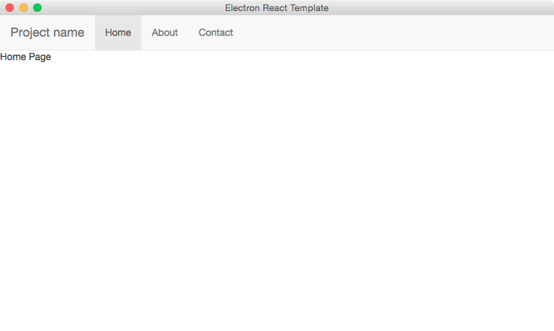

# electron-react
Project template for Electron with React support.

[](https://gemnasium.com/DenisVuyka/electron-react)

## Introduction

This template provides the following features pre-configured and ready to be developed with:

- Prebuilt version of [Electron](https://github.com/atom/electron) (former Atom Shell)
- React support (es6)
  - [React](https://facebook.github.io/react/index.html)
  - [React Bootstrap](eact-bootstrap.github.io)
  - [React Router](https://github.com/rackt/react-router)
- [Font Awesome](http://fontawesome.io)
- [LESS](http://lesscss.org) support

Additional features for development:

- [Grunt](http://gruntjs.com) tasks
  - Compiling LESS stylesheets
  - Compiling and bundling React components
  - Change watching and live reload of the content
- [Bower](http://bower.io) settings
- Useful NPM scripts

Default template also provides basic application menu integration for Windows and OS X, together with navigation to demo Routes (React Router) by means of application menu items and cross-process messaging support provided by Electron shell.



## Getting started

### Installing dependencies

```bash
bower install
npm install
```

### Bulding project

Development

```bash
grunt
```

Release

```bash
grunt dist
```

### Live Reload

You may want running this task on a separate terminal or command prompt instance:

```bash
grunt serve
```

For development purposes `index.html` already contains reference to live reload scripts. Every time React components, less stylesheets or other web-related files are changed the application will be automatically rebuilt and reloaded.

```html
<script src="http://localhost:35729/livereload.js"></script>
```

### Running with Electron

You may want running this task on a separate terminal or command prompt instance:

On Windows:

```cmd
npm run win
```

On OS X:

```bash
npm run osx
```

This command will launch a prebuilt version of Electron with the current project. During development process it is recommended running Live Reload feature prior to using Electron.

## Typical development process

- Run `bower install` and `npm install`
- Run `grunt serve` on a separate terminal tab (or command prompt) to build the project and start watching files automatically
- Run `npm run win` or `npm run osx` on a separate terminal tab (or command prompt) to run Electron with the current project
- Start changing or adding the code, it will be automatically rebuilt on background and your Electron window will reload once rebuilding is complete
